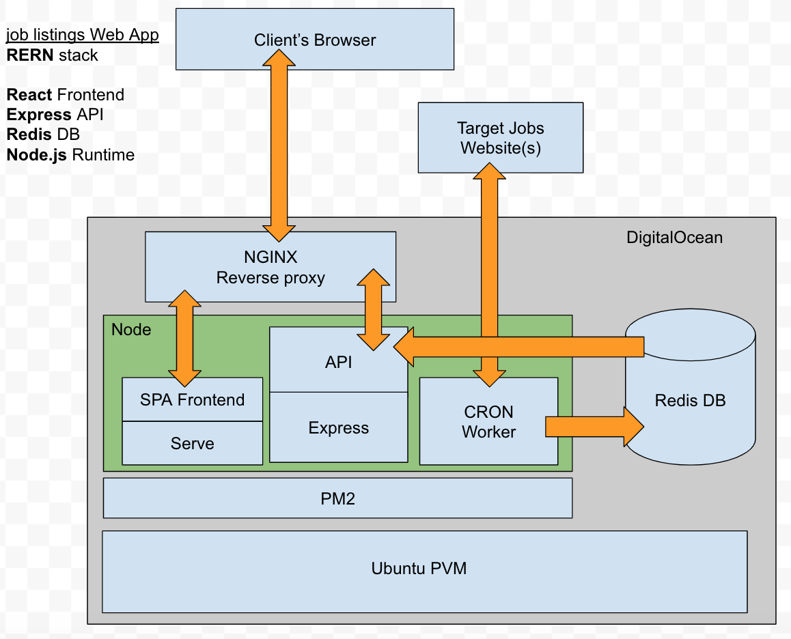

This is a Full Stack web application which displays a list of filtered junior developer jobs. The frontend is React & Material UI and the backend is Node.js and Express. This app runs on a Digital Ocean Virtual Private Server. 

[The Job Board App Website](https://engine541.com "Job Board Website")

[View source (Github)](https://github.com/dan-esh/RERN_job_board "Job Board App Github")